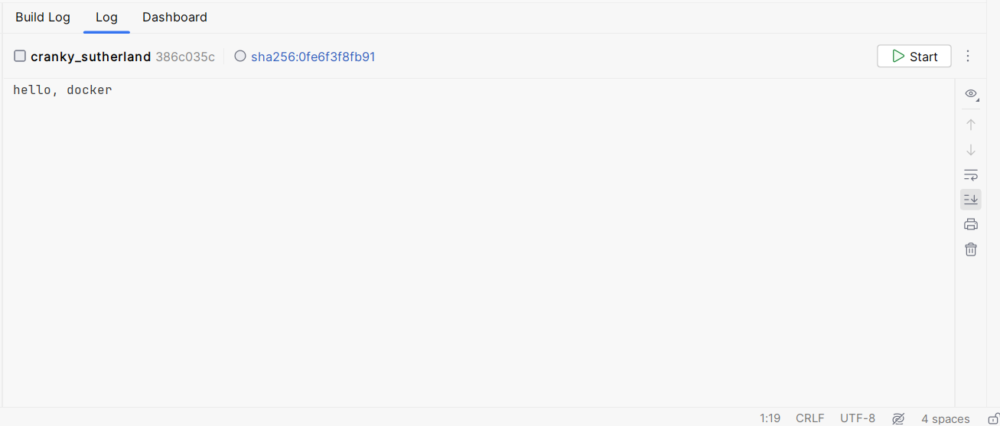

## Day 04 of docker learn 

---
##### Day 04 -- learn about,Creating image , run Containers &  Docker file basic 

---

##### Docker file 

what is the **Docker file** : Docker file is the text doc , containing **commands** that users can call on the command line to assemble an docker image.
* its serves the as instractions for creating and building an image.
* its specific the basic image, any additional dependencies or configurations needed, and commands to run when image is instantiated to create a **docker** container.
* the **docker file** used to automate the process of creating **Docker** image, making its easyer to deploye and manage application in container.

##### docker file basic 


##### Docker create and run the Container
* creating the docker image
1. first step is to creating a one **work space**, (ex: im creating a one basic js hello world program)

    ```bash
    echo >> index.js #creating a one js file 
    ```
   ```bash
      #write your code 
      #index.js
      console.log("hello, docker")
   ```
2. next think is creating a one **Dockerfile**
   ```bash
    echo >> Dockerfile
    ```

3. writing the **Dockerfile** , in the Dockerfile, define the steps required ti set up your application , henc's the basoc example 
   
   ```bash
   #use the exesting nodejs image from docker hub
   FROM node:20.10.0
   
   # set the working directory inside the container
   WORKDIR /usr/src/app
   
   # copy the rest of the application code 
   COPY . .
   
   # run the command
   CMD node index.js

   ```
   
4. **build the docker image** , open your terminal , bash or command prompt , to navigate the your working, dir , containing the **Dockerfile**, and **run**.
   ```bash
    docker build -t my-example-app . 
   ```
   * this command builds a Docker image named ```my-example-app``` using the ```Dockerfile``` in the corrent dir ``.`` .

5. **run the docker containenr**, once the image build , you can run it as a container using following ```cmd```,
   ```bash
   dokcer run my-example-app
   ```
   * this command starts a container based on youe ```docker image```.
   * its shows the ```output on your termainal``` 
   

   
   * ```bash
     #out put
      hello, docker
     ```
     
6. this is the basic of docker file , creating a docker image , run as a container using ```dockerfile```. 
the next , day we learn indepth of docker images ,crating a web application , portmaping and etc.... 

### reference:

---
basic of docker [link](https://www.youtube.com/watch?v=3c-iBn73dDE&pp=ygUMZG9ja2VyIGJhc2lj)

docker file readme.md ref [!docker-file-docker-doc.md](docker-file-docker-doc.md)
dokcer file refference [link](https://docs.docker.com/reference/dockerfile/)

example code click hear 👉 [!ex](./ex)
